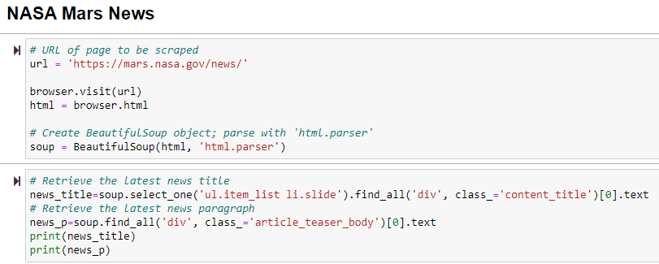
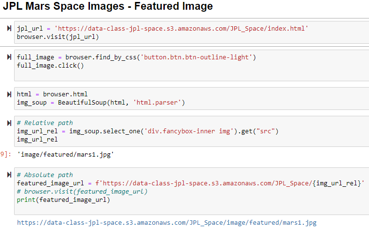
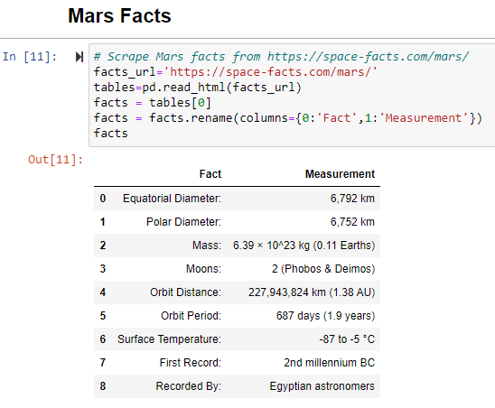
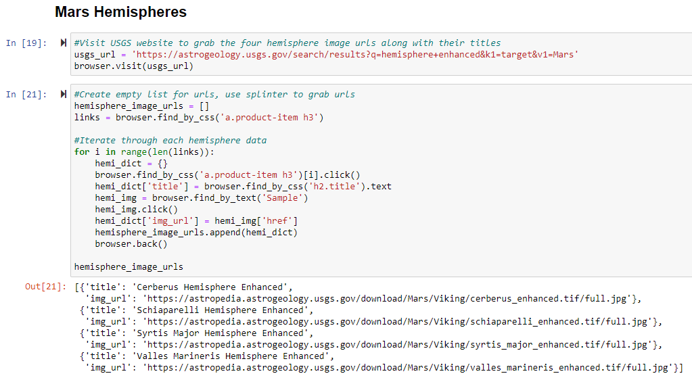
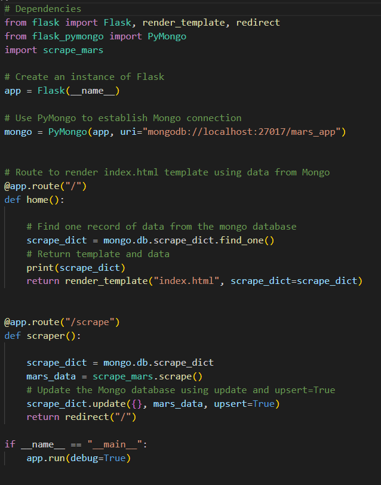
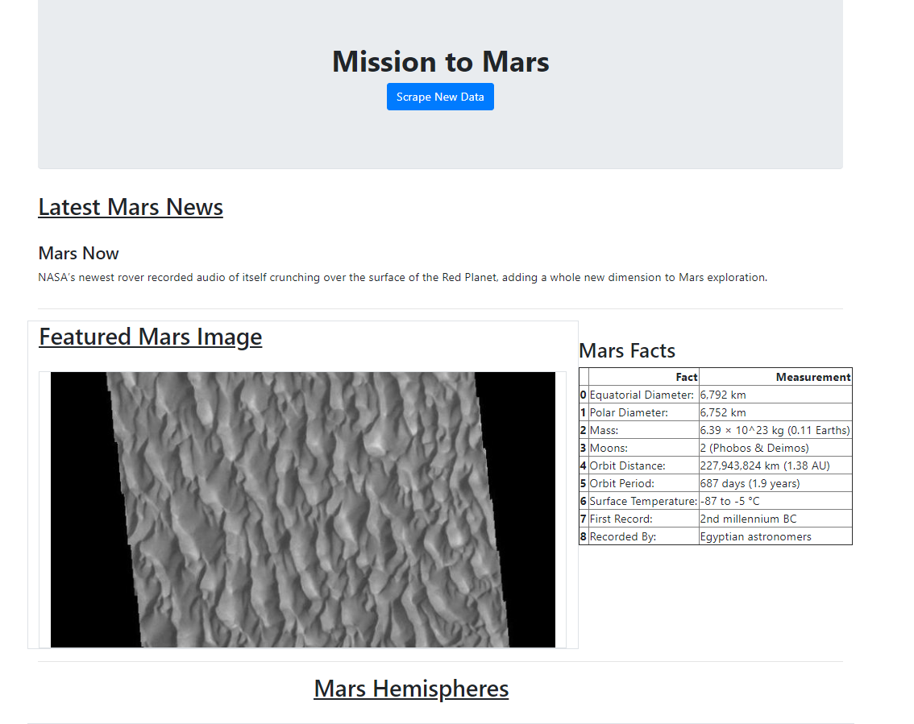
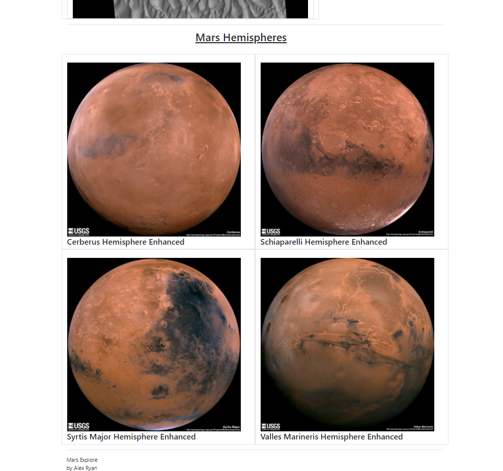

# Mission to Mars

# Summary
The purpose of this project is to design a web application that scrapes various Mars-related websites that displays the information in a single HTML page. Flask is used to deploy the scraped data to the HTML page. Using Bootstrap, a "Scrape New Data" button on the HTML page can be used to re-scrape the sites below to ensure all information is up-to-date.

#
## Step 1 - Scaping

By creating a Jupyter notebook file called `mission_to_mars.ipynb`, I initiated the web scraping by utilizing ChromeDriverManager and Beautiful Soup.

#
### [NASA Mars News Site](https://mars.nasa.gov/news/?page=0&per_page=40&order=publish_date+desc%2Ccreated_at+desc&search=&category=19%2C165%2C184%2C204&blank_scope=Latest)

The first task was to retrieve the latest news article's title and descriptive paragraph.

#
### [JPL Featured Space Image](https://data-class-jpl-space.s3.amazonaws.com/JPL_Space/index.html)

Next, I was to scape the monthly featured image. At the time of me complting this assignment, the JPL site no longer offered this feature, therefore the image was scraped from a simple Amazon S3 Bucket link. 

Here I used Splinter `find_by_css` and assigned to `.jpg` to a url string called `featured_image_url`.

#

### [Mars Facts](https://space-facts.com/mars/)

Next, my goal was to perform a simple pandas scrape using `pd.read_html`. Here I collected a table of facts located in the top right corner of the webpage. The facts were then converted into a HTML table string.

#
### [Mars Hemispheres](https://astrogeology.usgs.gov/search/results?q=hemisphere+enhanced&k1=target&v1=Mars)

The final scraping objective was to navigate to the USGS website to collect the four image urls and the corresponding images available.

I then used a Python dictionary to store the data using the keys `img_url` and `title`.

#
# MongoDB and Flask App

* My next objecteive was to convert my Jupyter Notebook into a Python script called `scrape_mars.py`, which contains a function called `scrape`. This will execute all scraping described above to return a Python dictionary I chose to name `scrape_dict`.

* I then created a route in my Flask application called `/scrape` to import my `scape_mars.py` script, calling my `scrape` function. This value was stored in Mongo DB as a Python dictionary.

* I created a home route, `/` that queries my Mongo database and passes the Mars data into an HTML template to display the data.

* Finally, I created a HTML file called `index.html` that takes the Mars data dictionary and displays all of the data in the appropriate HTML elements.

# 

# Visiualizations

Below are screenshots of my final product!

 

 

#
# Running the Code

* To run this code, complete the following steps:

    * Clone this repository to your local machine

    * Next, navigate to the directory `web-scaping-challenge` and run the command `$ python app.py`

    * You will then need to follow the local host link `http://127.0.0.1:5000/` that pops up in the terminal

    * The scraping will take a few moments. Patience is key!

